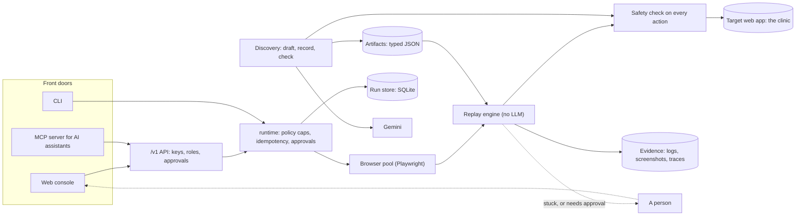

# Computer-Use Automation System

Most legacy and vendor web UIs have no API. They get automated by scripts that break when the page changes, or by an AI agent that drives the UI live on every run: slow, costly, unpredictable.

This project takes a middle path. **An LLM (a large language model; here, Google's Gemini) works out a task once. That run is recorded as a typed, reusable artifact. Every run after that is a deterministic replay with no LLM and no tokens**,
wrapped in safety checks, human approval, and a full evidence trail.

- **Discover** a task from one sentence, on a practice system, and review the recording before anyone can run it.
- **Replay** it for any record, in about 2 seconds, with the same guarantees every time (a retry can never post twice).
- **Stay in control**: commits wait for approval, a stuck run pauses for a person to take over, and a changed screen produces a repair proposal a person approves.

> Status: in active development on `dev`. A hosted demo is still to come. Measured results are [at the end](#results).

## How it works

```
 one sentence  ──►  DISCOVER (an LLM looks at the page, decides, acts)  ──►  ARTIFACT (typed JSON, reviewed by a person)
                                                                                      │
                                                                                      ▼
                                       REPLAY (no LLM, deterministic)  ◄──  any request, from any front door
                                                  │
              ┌───────────────────────────────────┼────────────────────────────────────┐
              ▼                                   ▼                                    ▼
        safety checks                      three-way result                     human in the loop
 (allowlist + risk on every action)  success / business outcome / failure   (approve, take over, repair)
```

### Architecture



- **Discovery** reads the page as an accessibility-tree element list (not pixels) and drives a real browser one action at a time. Recording is deterministic code, not the LLM.
- **Replay** classifies every page state. A known *business outcome* ("no such record") is a result, a *recoverable* condition is handled, anything else is a failure that can pause for a person.
- **Safety** lives in one chokepoint, `Surface.act()`, which discovery and replay both pass through. An irreversible action is blocked unless a human confirms it.
- **Every front door** goes through the same `runtime` code, so none of them can skip safety, evidence or approval.

## Quickstart

Needs Python 3.12, [uv](https://docs.astral.sh/uv/) and Node 20+.

```bash
uv sync
uv run playwright install chromium
cp .env.example .env                        # add GEMINI_API_KEY only to discover new tasks or use chat
(cd ui && npm install && npm run build)     # the web console, built once
```

Start the practice clinic and the platform, in two terminals:

```bash
uv run uvicorn clinic.app:app --port 8100
uv run uvicorn api.app:app --port 8020
```

Create one key per role (each is shown once), then open <http://localhost:8020/ui/> and sign in with one:

```bash
uv run python cli.py keys create --name alex --role operator
uv run python cli.py keys create --name dana --role supervisor
```

## Try it (about 10 minutes)

1. **Run a task.** Sign in as `alex`, open *Look up a patient by MRN*, enter MRN `LK-100002`, choose *Slow*, and press Run. Watch the amber outline follow each step, then read the result and the step timeline.
2. **See approval.** Open *Issue a refund*, enter invoice `INV-30001`, amount `25.00`, reason *duplicate payment*. It waits for a supervisor. Sign in as `dana` (a different key: you cannot approve your own request),
   open the **Inbox**, and approve it. It runs once, and the clinic's audit log at <http://localhost:8100/_test/audit> shows exactly one refund.
3. **Discover a task.** As `dana`, open **Discover** and type: *Look up appointment A-20002 and tell me the patient and the provider.* Draft it, start discovery, and watch the LLM work. Review the recorded steps,
   make it available, then run it as `alex` for another appointment (such as `A-20004`). Needs `GEMINI_API_KEY`.
4. **Change the screen.** Open the clinic's control panel, <http://localhost:8100/_test/panel>, and set UI drift to level 2 (labels renamed). Run that patient lookup again: it fails because the page changed, and the **Inbox**
   shows a repair proposal. Approve proposals and re-run (about four) until it works again. Switch drift off afterwards.

## Run the tests

```bash
uv run pytest                                  # everything offline: about 15 minutes, drives a real browser
uv run pytest tests/test_replay_engine.py -q   # one file, in seconds
uv run python scripts/benchmark.py all         # the measurements below (discovery needs GEMINI_API_KEY)
```

434 tests pass. They start the clinic in-process and drive a real Chromium. Eight call the real LLM and skip without `GEMINI_API_KEY`. The browser tests for the console and the clinic's React skin skip until those
are built (`cd clinic/modern && npm install && npm run build`). `.github/workflows/ci.yml` runs the offline tests on every push.

## Reference

<details>
<summary><b>The console, by role</b></summary>

What you see follows your key's role. The role decides visibility only; the API enforces every permission itself.

| Role | Sees |
|---|---|
| viewer | Tasks and Runs, read-only |
| operator | Tasks, My runs, Inbox (the badge counts only what *you* can decide), Chat |
| supervisor | The above, plus **Discover** |
| admin | The above, plus **Manage**: Overview (metrics), Artifacts, Policy, API keys |

Keyboard: `g` then a letter to jump between pages, `/` to search, `?` for help. To open a real browser window as well as the live view, start the API with `CUA_ALLOW_WINDOW=1`.

A run that gets stuck pauses instead of failing. An operator opens it from the Inbox, acts on the run's own browser (click, type, choose), then hands it back or stops it. It waits a limited time, and only one run
may wait at once (`escalation:` in `safety/policy.yaml`).
</details>

<details>
<summary><b>Discovering a task: what happens</b></summary>

1. The LLM looks at the system's main page and **drafts** the task: name, inputs, what it reads back, and whether it only reads. If an example value is missing it asks instead of inventing one.
2. It drives a practice copy using only clicks and typing. Detours and failed actions are pruned from the recording.
3. The result is saved as a **draft** that nobody can run. The system chooses what text shows success, then replays the draft once with no LLM. A recording that never uses its input, or finds what it reads by the
   value it saw last time, is not offered as ready.
4. You review the recorded steps and make it available (the same approval tier as any promotion), or discard it.

A task declared read-only can never commit. If the LLM reaches the one irreversible step it stops and asks you. Passwords, secrets and tokens are refused as inputs. One session runs at a time. Limits are under `discovery:` in `safety/policy.yaml`.
</details>

<details>
<summary><b>HTTP API</b></summary>

`/v1` is authenticated and asynchronous (interactive docs at `/docs`). A key's name is recorded as the requester or approver, and its role decides what it may do.

```bash
curl -s -X POST localhost:8020/v1/runs -H "Authorization: Bearer $ALEX" -H "Idempotency-Key: refund-INV-30001-1" -H 'content-type: application/json' \
  -d '{"capability_id":"clinic.issue_refund","target":"clinic","params":{"invoice":"INV-30001","amount":"25.00","reason":"duplicate_payment"}}'
curl -s -X POST localhost:8020/v1/runs/RUN_ID/approve -H "Authorization: Bearer $DANA" -H 'content-type: application/json' -d '{"reason":"invoice checked"}'
```

A run returns `202` and an id at once; follow it with `GET /v1/runs/{id}` or the `/events` stream. The caller never supplies a URL or credentials; the target profile decides.
</details>

<details>
<summary><b>AI assistants (MCP)</b></summary>

`mcp_server.py` exposes every recorded task as an MCP tool, as a thin client of `/v1` under the assistant's own key, so the key's role is its ceiling. There is no tool to approve, a task that commits
requires an idempotency key, and an assistant that gets stuck fails at once. For Claude Desktop (the API and the clinic must be running):

```json
{"mcpServers": {"capability-platform": {"command": "uv", "args": ["--directory", "/absolute/path/to/this/repo", "run", "python", "mcp_server.py"],
  "env": {"CUA_API_URL": "http://127.0.0.1:8020", "CUA_API_KEY": "cua_..."}}}}
```
</details>

<details>
<summary><b>Command line</b></summary>

```bash
uv run python cli.py replay --target clinic --capability clinic.patient_lookup --param mrn=LK-100002                 # replay, no LLM
uv run python cli.py replay --target clinic --capability clinic.patient_lookup --param mrn=LK-100002 --headed --slow-mo 600
uv run python cli.py discover --target clinic --capability clinic.patient_lookup --param mrn=LK-100001              # discovery from a catalog spec
uv run python cli.py artifact list                                                                                 # versions, drafts, what is current
uv run python cli.py runs pending
uv run python cli.py approve RUN_ID --by suzie.visor --reason "checked the invoice"
uv run python cli.py repair list --status pending                                                                  # then: repair show / repair approve
uv run python cli.py canary run --target clinic                                                                     # read-only replays that catch drift early
uv run python cli.py metrics --hours 24
```

Approver names come from the roster in `safety/policy.yaml`. Metrics are also at `GET /v1/metrics` and `/v1/metrics.prom` (Prometheus). The server logs one JSON line per event, each with its `run_id`.
A failed run against a sandbox keeps a Playwright trace: `uv run playwright show-trace evidence/<run>/trace.zip`.
</details>

<details>
<summary><b>The practice clinic</b></summary>

`clinic/` is a fictional clinic front desk and billing portal, built to be automated and measured: a legacy server-rendered skin (`/legacy`, signs in as `frontdesk` / `desk-demo-123` or `supervisor` / `super-demo-123`),
a React skin (`/app`), a JSON API, and a test kit (`/_test`) with an audit log as ground truth, an idempotent reset, fault injection (latency, 500s, maintenance pages, session expiry, rate limits), a switch for the target's own
duplicate-submit guard, and four levels of UI drift. All data is synthetic. `docker compose up --build` runs it in a container; set `CLINIC_TEST_TOKEN` on any deployment that is not purely local.
</details>

## Where things are

| Area | Paths |
|---|---|
| **Discovery and replay** | `agent/` (discovery loop, recorder) · `discover/` (discovery from the console) · `replay/` (engine) · `surface/` (Playwright, browser pool) · `artifacts_lib/` (schema, versions, lint, diff) |
| **Safety and runs** | `safety/` (allowlist, risk, `policy.yaml`) · `runs/` (SQLite store, executor) · `repair/` (drift repair, canaries) · `escalation/` · `evidence_lib/` |
| **Interfaces** | `api/` (the `/v1` API) · `ui/` (web console, Next.js) · `mcp_server.py` · `cli.py` · `runtime.py` · `observability.py` |
| **Practice system** | `clinic/` (both skins, JSON API, audit log, fault injection, drift) |
| **Data** | `artifacts/` (one folder per task, every version) · `data/` (run database) · `evidence/` (screenshots, logs, traces) |
| **Other** | `tests/` · `scripts/` (`benchmark.py`, `discover_clinic.sh`) · `.github/workflows/ci.yml` |

The original MockBank sample and the older chat and dashboard live on the `mockbank` branch; the engine tests still use a small copy of the MockBank site under `tests/support/`.

## Results

Measured with `uv run python scripts/benchmark.py all --trials 3` against the bundled clinic (about 25 minutes). Small samples on one target: read them as how this system behaved here, not as a promise for someone else's software.

- **Faults:** 159 replays under injected faults (slow pages, a transient 500, a lost session, a maintenance page, errors and a lost session around a commit). Every one ended as it should, carrying on or stopping safely.
  None double-posted or left the record disagreeing with the result, checked against the clinic's audit log with its own duplicate guard off.
- **UI drift:** with ids, labels and field names changed, 14 of 14 task runs at the two levels that break replay recovered through human-approved repairs (4 to 5 proposals per task at level 2, up to 11 at level 3).
  All 77 proposals were right, and every commit changed state exactly once.
- **No LLM at replay:** 0 LLM calls across 180 replays; a replay takes about 1.8 s.
- **Discovery:** from one sentence, 3 of 4 read-only tasks were recorded in every attempt (9 of 9), in about 11 s and 13k tokens, 6 steps on average, and each recording was right on 10 other records (90 of 90).
  The 4th (the first row of a table with no labels) is refused with a reason, because the recorder cannot yet describe such a cell so that it carries over to other records.
- **Next:** a hosted demo of the clinic, a green first run of the CI workflow, and discovering a task on the clinic's React skin.
