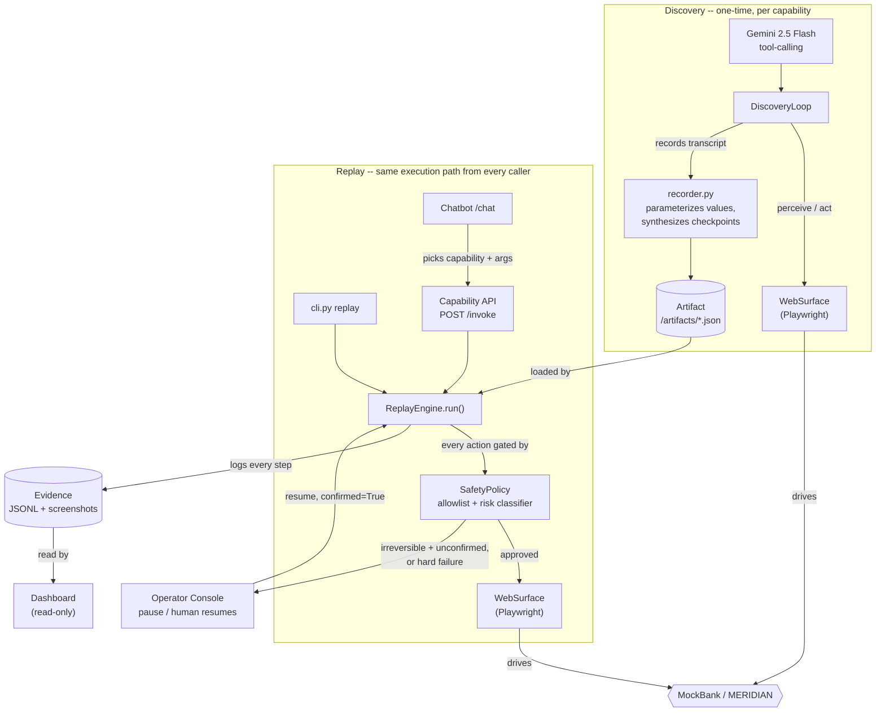

# Computer-Use Automation System

A system that takes a natural-language goal, uses an LLM to accomplish it against a live UI
("computer use"), records the successful run as a typed reusable artifact, and replays that
artifact deterministically -- without the LLM in the loop -- with structured error handling and a
human escalation path. Capabilities are exposed as a callable API, driven by a thin chatbot, with
every run visible on a read-only dashboard.

**This branch is the MERIDIAN CORE adaptation** -- the same core pointed at a real, externally
hosted target (`web-sample.interface-hiring.com`), covering all 7 of its functions, wrapped as a
demoable capability API + chatbot + dashboard. See `/WRITEUP.md` for the adaptation write-up.
**MockBank** -- the original take-home's local fixture -- still works unchanged and is covered
near the end of this file, mainly as an offline fallback.

> Status: the full vertical slice works end to end against MERIDIAN: goal -> discovery -> saved
> typed artifact -> deterministic replay -> human escalation, plus the capability API, chatbot,
> and dashboard wrapping all of it. All 7 MERIDIAN functions are recorded as capabilities and
> replay deterministically, including the review->post confirmation flow and supervisor-gated
> Place Hold. `/REPORT.md` is the original take-home's design write-up; `/WRITEUP.md` is this
> adaptation's.

## Tech stack

| Layer | Choice |
|---|---|
| Language / tooling | Python 3.12, `uv` (deps + venv, not pip/poetry) |
| Browser automation | Playwright (sync API), accessibility-tree-driven -- no coordinates, no visual models |
| Discovery LLM | Gemini 2.5 Flash (`google-genai` SDK) -- tool-calling drives the browser at discovery time only; replay never calls it |
| Artifact schema | Pydantic -- typed `Step`/`Artifact` models, also used directly as the capability API's JSON Schema |
| API / chatbot / dashboard | FastAPI, one process, mounted as separate routers |
| Server-rendered UI | Jinja2 -- MockBank fixture, operator console, dashboard |
| Evidence | JSONL event log + screenshots per run, on disk under `/evidence` |
| Target apps | MockBank (local FastAPI + Jinja2 fixture) and MERIDIAN CORE (hosted, `web-sample.interface-hiring.com`) |

## Architecture

The one point this diagram is meant to make: **every entry point runs through the same
`ReplayEngine`, gated by the same `SafetyPolicy`** -- the API and chatbot are wrappers around the
CLI's own execution path, not a second implementation of it.



## Setup

```bash
uv sync
uv run playwright install chromium
cp .env.example .env   # then fill in GEMINI_API_KEY (see below)
```

Get a free `GEMINI_API_KEY` at https://aistudio.google.com/apikey -- no billing required,
free-tier rate limits apply. Needed for the chatbot and `discover`; not for `replay`, the
capability API, or the dashboard.

No other keys or config are needed for MERIDIAN CORE -- it's a hosted target with public demo
credentials, no local server to start:

| Operator | Password | Role |
|---|---|---|
| `teller1` | `password` | teller |
| `super1` | `password` | supervisor (can perform restricted actions, e.g. Place Hold) |

Seed members: `100234`, `100987`, `101555`, `102777`, `103001` -- `100234` (Lovelace, Ada) is the
one with shares already on HOLD (verified live: 7 of its 13 shares). The app is stateful in
memory and resets on redeploy -- don't rely on data (balances, shares, holds) persisting across
sessions.

## Capability API, chatbot, and dashboard

One process serves all three -- the capability API, the chatbot, and the dashboard all live on
the same FastAPI app, per the brief's own "simpler is fine if justified":

```bash
uv run uvicorn api.app:app --port 8020
```

| Surface | URL |
|---|---|
| Capability catalog (JSON) | `http://127.0.0.1:8020/capabilities` |
| Invoke a capability (JSON) | `POST http://127.0.0.1:8020/capabilities/{capability_id}/invoke` |
| Chatbot | `http://127.0.0.1:8020/chat` |
| Dashboard -- catalog | `http://127.0.0.1:8020/dashboard` |
| Dashboard -- run history | `http://127.0.0.1:8020/dashboard/runs` (click a run for its full event timeline + screenshots) |
| Operator console (escalation) | starts automatically on process boot at `http://127.0.0.1:8010/operator` -- lists every currently-paused run |

### Calling `/invoke` directly

```json
{
  "params": {"member_id": "100987"},
  "target": "meridian",
  "headed": false,
  "slow_mo": 0
}
```

- **`params`** -- the capability's typed inputs, per its `input_schema`.
- **`target`** -- `"mockbank"` or `"meridian"`. Defaults to `"mockbank"` if omitted, so pass
  `"meridian"` explicitly for anything on this branch.
- **`headed` / `slow_mo`** -- optional. A normal replay runs headless and finishes in under a
  second, too fast to watch. Set `headed: true` (and a `slow_mo` in ms) to pop open a real,
  visible Chromium window and slow each action down. The window stays open after the run
  finishes so you can review the final page -- close it manually before starting another headed
  run.

The chat page exposes `headed`/`slow_mo` as a plain "Show browser" checkbox and speed selector,
so you don't need to construct this JSON by hand to watch a run live.

### One execution path

`cli.py replay`, a raw `POST /invoke`, and the chatbot all call the exact same
`runtime.run_replay()` function underneath. None of these three surfaces is a separate
implementation, so none of them can become a way around the safety/evidence/escalation
guarantees described below -- what's true for the CLI is true for the chatbot.

## Demo path

With the server above running (`uv run uvicorn api.app:app --port 8020`):

```bash
# Discovery: a real Gemini-driven run that figures out how to update a member's contact info
# with no hardcoded steps, watching it drive the actual MERIDIAN pages, then saves the result
# as a typed, reusable artifact. Picked deliberately: meridian.update_member isn't replayed
# anywhere else in this demo path, so re-discovering it can't destabilize another step.
uv run python cli.py discover --capability meridian.update_member --target meridian \
  --param member_id=100987 --param email=member100987@example.com \
  --param phone=555-0187 --param address="123 Elm St, Springfield" \
  --headed --slow-mo 500

# Replay an already-recorded MERIDIAN capability directly (no LLM call needed):
uv run python cli.py replay --capability meridian.balance_inquiry --target meridian --param member_id=100987

# Or invoke it over HTTP, the same path the chatbot itself uses:
curl -s -X POST http://127.0.0.1:8020/capabilities/meridian.balance_inquiry/invoke \
  -H 'Content-Type: application/json' \
  -d '{"params": {"member_id": "100987"}, "target": "meridian"}'
```

Or open `http://127.0.0.1:8020/chat` and type a request in plain language, e.g. *"look up the
balance for meridian member 100987"* or *"transfer $5 from 100987-S0001-4 to 100987-MMKT-5 for
member 100987"* -- check "Show browser" first to watch the real Chromium window drive
MERIDIAN's actual pages. Every run (chatbot, API, or CLI) shows up immediately at
`http://127.0.0.1:8020/dashboard/runs` with its status, structured outputs, and full evidence.

All 7 MERIDIAN functions are recorded under `/artifacts/meridian.*.json` and replay the same
way: `meridian.signon` (precondition for the rest), `meridian.balance_inquiry`,
`meridian.funds_transfer`, `meridian.open_share`, `meridian.update_member`,
`meridian.place_hold` (run as `teller1` for a permission-denied business outcome, or override
`--username super1 --password password` for a real supervised hold).

## Escalation / human handoff

The transfer example above is irreversible and will pause for a human -- this is the single most
important thing to have muscle memory for. Open `http://127.0.0.1:8010/operator` (linked
directly from the chat page) to see the paused run listed, click in, find the confirm button's
element ref in the table shown, fill in the "Perform an action manually" form (Action: `click`,
the ref, check "I confirm this action"), click **Perform**, then **Resume Automation**. The chat
bubble updates itself (no refresh needed) from "paused, needs a human" to the final result with
a real confirmation number.

Mechanically: the run is genuinely blocked on a live browser session, not polling. The operator
console runs on its own thread and never touches the live page directly (Playwright's sync API
isn't safe across threads) -- it only enqueues the action you submit; the automation thread,
still holding the real page, performs it and resumes itself. This is the same mechanism whether
the run came from the CLI, a raw API call, or the chatbot -- one path, not three separate ones.
Pass `--no-operator-console` to `cli.py` to disable this and have a stuck run just fail
immediately instead.

## What needs live services, and what doesn't

| Command | Needs `GEMINI_API_KEY` | Needs MockBank running | Needs network access |
|---|---|---|---|
| `pytest` | no (see note) | no | no, unless `GEMINI_API_KEY` is set (see note) |
| `uv run python cli.py replay --target mockbank ...` | no | yes | no |
| `uv run python cli.py replay --target meridian ...` | no | no (hosted) | yes |
| `uv run python cli.py discover ...` | yes | target-dependent | yes (Gemini call, always) + target's own network need |
| `uv run uvicorn api.app:app` (capability API + dashboard) *(just starting it, nothing invoked yet)* | no | no | no |
| ↳ then invoking a `target: "mockbank"` capability through it | no | yes | no |
| ↳ then invoking a `target: "meridian"` capability through it | no | no (hosted) | yes |
| `/chat` (chatbot) *(just loading the page)* | no | no | no |
| ↳ Gemini declines the message (out of scope, e.g. "what's the weather") | yes | no | no |
| ↳ Gemini calls a MockBank capability | yes | yes | no |
| ↳ Gemini calls a MERIDIAN capability | yes | no (hosted) | yes |

Three tests make real external calls and auto-skip (not fail) rather than run by default:
`tests/test_discovery_live.py` and `tests/test_chatbot_live.py` skip without `GEMINI_API_KEY`
(real Gemini calls, against local MockBank -- no external site involved);
`tests/test_meridian_guarantees.py` skips unless `RUN_MERIDIAN_LIVE_TESTS=1` is set, since it
hits the real, live, external MERIDIAN site with genuine side effects (a real transfer posts):

```bash
RUN_MERIDIAN_LIVE_TESTS=1 uv run pytest tests/test_meridian_guarantees.py
```

Every other test is unaffected either way. The default `uv run pytest` needs no live services --
but if `GEMINI_API_KEY` is set (which Setup above has you do), it genuinely does make real,
external network calls to Google's Gemini API via `test_discovery_live.py`/`test_chatbot_live.py`,
not just to local MockBank. Unset the key first if you want a fully offline test run.

("no" for MockBank means you don't need to start it yourself -- the WebSurface tests spin up a
real MockBank instance in-process on an OS-assigned free port for the duration of the test
session, and drive it with a real headless Chromium via Playwright.)

## Repo layout

```
/mockbank        MockBank target app (FastAPI + Jinja2)
/surface          Surface abstraction: perceive()/act(), the aria-snapshot element-list parser,
                   and the locator fallback-chain resolver. WebSurface (Playwright) is the only
                   implementation; both discovery and replay drive a surface through this same
                   interface, the seam that would let a future desktop/legacy-web surface slot
                   in without changing discovery or replay.
/agent            LLM-driven discovery loop (decides what to do; acts through a Surface),
                   the Gemini client, and the capability catalog (agent/catalog.py -- the
                   human-authored contract each discovery run fills in; includes meridian.* specs)
/artifacts_lib    Pydantic artifact schema, JSON storage, validation
/replay           Deterministic replay executor, error classifier (acts through a Surface)
/safety           Allowlist config (allowlist.json for MockBank, allowlist_meridian.json for
                   MERIDIAN), risk classifier
/escalation       Session manager, operator console (human handoff) -- shared by every surface
/evidence_lib     Structured JSONL logger, redaction -- wired into every Surface.act() call
/artifacts        Saved capability artifact JSON files (mockbank.* and meridian.*)
/evidence         Logs/artifacts from real discovery + replay runs (required deliverable)
/api              The capability API (app.py), chatbot (chatbot.py), and dashboard
                   (dashboard.py) -- one FastAPI app, mounted as separate routers, all calling
                   runtime.run_replay() underneath
/tests            pytest -- schema validation, surface/locator behavior, error classification,
                   the capability API, the dashboard, and (opt-in) live MERIDIAN coverage
runtime.py        The one execution path every front door (CLI, API, chatbot) calls to actually
                   run a capability -- TARGET_PROFILES, run_replay(), the operator console
                   bootstrap. See its own module docstring.
cli.py            `discover` and `replay` commands -- see Demo path above
```

## MockBank -- the original take-home target, still here as an offline fallback

Everything above also works with `--target mockbank` (the CLI's default if `--target` is
omitted) or `"target": "mockbank"` in an API call -- the same capability API, chatbot, dashboard,
and escalation console, just pointed at a small local fixture instead of the real hosted site.
Useful if MERIDIAN or your network is unreachable.

Start it in a separate terminal first:

```bash
uv run uvicorn mockbank.app:app --port 8000
```

One hardcoded operator login (no self-registration -- see "What's mocked" below): username
`operator`, password `bankdemo123`. Both are dummy values checked into `mockbank/data.py`; they
are not secrets and grant access to nothing but this local mock app.

### Trying it manually

Log in at http://localhost:8000/login, then search a member ID:

| Member ID | Result |
|---|---|
| `10001`, `10002`, `10003` | Active member -- Account Summary with savings/checking balances |
| `40004` | Permission-denied business outcome ("Access denied") |
| anything else | Not-found business outcome ("No member found") |

From an active member's page, "Open Sub-Account" walks through account type (Savings/Checking) +
initial deposit -> a validation error if the deposit is missing/non-positive -> a confirmation step
-> a success page with a confirmation number. The new sub-account then shows up on the member's
page under "Sub-Accounts" -- confirming the action actually persisted, not just displayed a message.

The four environmental/recoverable conditions (slow load, transient "service unavailable", an
unexpected terms-update modal, mid-flow session expiry) aren't reachable through the UI -- they're
armed one-shot, per-session, via a test-only route so the discovery agent never sees a "simulate a
failure" control sitting in the app it's operating:

```bash
curl "http://localhost:8000/_debug/simulate?condition=slow"   # or: unavailable | terms_modal | expire_session
```

Hit that (with the same session cookie/browser context you're about to use), then make the next
request -- that's the one the condition fires on.

### CLI demo path (MockBank)

```bash
# Discovery: a real Gemini-driven run that figures out how to look up a member's balance,
# with no hardcoded steps, then saves the result as a typed, reusable artifact.
uv run python cli.py discover --capability mockbank.member_balance_lookup --param member_id=10001

# Replay: deterministic, no LLM call, using a DIFFERENT member id than discovery used --
# proves the artifact genuinely generalized rather than replaying a hardcoded value.
uv run python cli.py replay --capability mockbank.member_balance_lookup --param member_id=10002

# Business outcomes instead of success (replay never needs GEMINI_API_KEY):
uv run python cli.py replay --capability mockbank.member_balance_lookup --param member_id=99999    # not_found
uv run python cli.py replay --capability mockbank.member_balance_lookup --param member_id=40004    # permission_denied
```

Both commands log in first (username/password default to MockBank's own `operator`/`bankdemo123`
credentials, per the previous section; override with `--username`/`--password`), print a
structured result, and write evidence -- a JSONL log of
every perceive/act plus screenshots -- to `/evidence/<run>/`. `discover` also saves the artifact
itself to `/artifacts/<capability_id>.json`. Add `--headed` to watch the browser instead of
running headless.

A second, hand-written capability -- `mockbank.open_subaccount` -- covers what the read-only
lookup above can't: a validation-error business outcome, and a genuine irreversible step (opening
the account is final) gated on human confirmation, using the same escalation mechanism described
above:

```bash
# Stops cleanly at a validation_error business outcome -- never reaches the irreversible step.
uv run python cli.py replay --capability mockbank.open_subaccount --param member_id=10002 --param account_type=savings --param initial_deposit=0

# Reaches the irreversible "Confirm & Open Account" step, gets blocked (unconfirmed), and pauses
# for a human to approve through the operator console.
uv run python cli.py replay --capability mockbank.open_subaccount --param member_id=10001 --param account_type=checking --param initial_deposit=300
```

`/evidence/replay_run_20260815T005612Z/` is a saved example of exactly this: `open_subaccount`
paused at its confirmation gate, a human approved the exact blocked action through the console
(`log.jsonl` shows it as an `actor: "human"` action with `confirmed: true`), and the run resumed
to a real completion.

### What's mocked, and why

- **No self-registration / sign-up.** MockBank stands in for internal back-office software used
  by bank employees -- core banking screens, servicing tools, admin consoles -- not a
  customer-facing product. Real systems like this provision accounts through IT/HR onboarding,
  not self-service sign-up, so a register flow would be unrealistic rather than a missing
  feature. One hardcoded operator login (`operator` / `bankdemo123`, both dummy values) stands
  in for that provisioning step. This also keeps the login flow a single reusable
  `mockbank.login` capability with real credential handling (never persisted, read from
  environment) without building an unneeded user-management surface.

## Data handling

Redaction (`evidence_lib/redaction.py`) covers real secrets only -- passwords, tokens,
credentials never hit disk. Balances, confirmation numbers, and member names captured in
evidence stay visible on purpose: everything both targets expose is synthetic seed/demo data,
and those exact values are what the evidence and dashboard exist to show. See `/WRITEUP.md` for
the full reasoning behind that scope decision.
